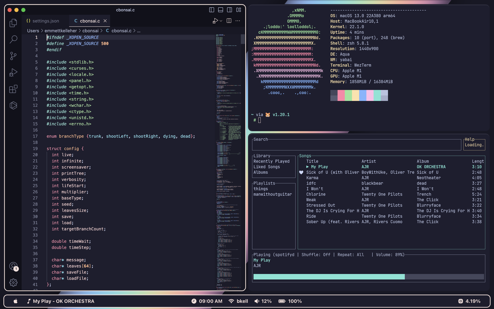
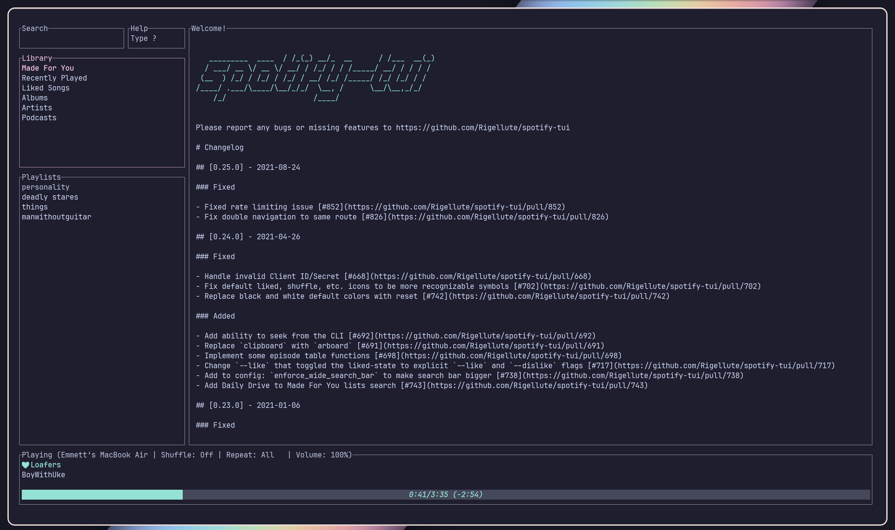
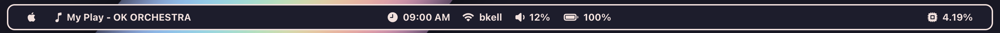
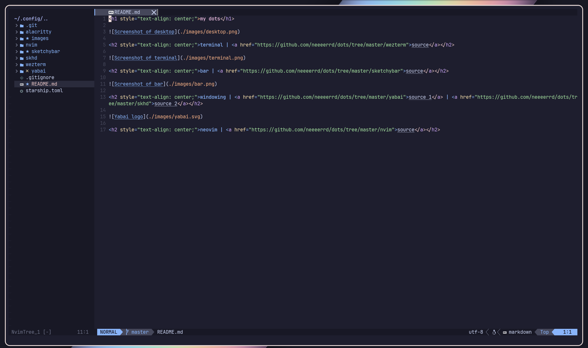

<h1 style="text-align: center;">My dots</h1>
<h2 style="text-align: center;">Revision 1</h2>

<h2 style="text-align: center;">terminal | <a href="https://github.com/neeeerrd/dots/tree/master/wezterm">source 1</a> | <a href="https://github.com/neeeerrd/dots/tree/master/alacritty">source 2</a></h2>

<h2 style="text-align: center;">bar | <a href="https://github.com/neeeerrd/dots/tree/master/sketchybar">source</a></h2>

<h2 style="text-align: center;">windowing | <a href="https://github.com/neeeerrd/dots/tree/master/yabai">source 1</a> | <a href="https://github.com/neeeerrd/dots/tree/master/skhd">source 2</a></h2>

<h2 style="text-align: center;">neovim | <a href="https://github.com/neeeerrd/dots/tree/master/nvim">source</a></h2>

<h6 style="text-align: center;">:)</h6>