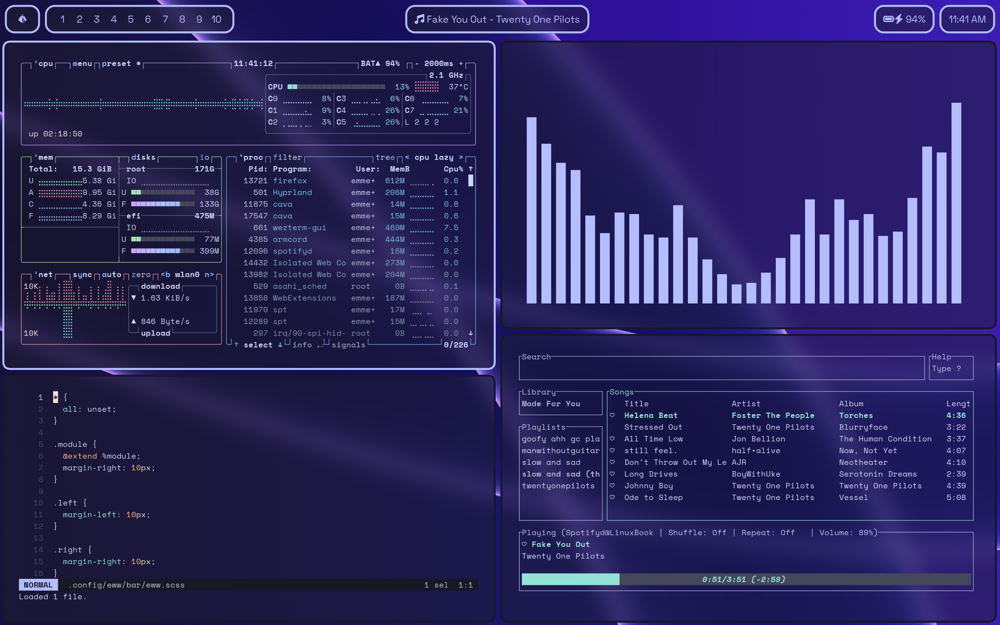

<h1 align="center">dotfiles again</h1>



## installation
###### note: nothing is guaranteed.
1. install paru
2.
```bash
paru -S hyprland-git eww-git cava-git helix-git wezterm playerctl
git clone https://github.com/neeeerrd/dots ~/.config
```

